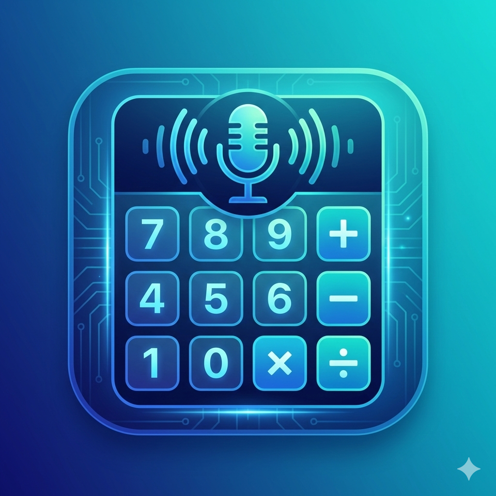

# Hesap - Türkçe Sesli Hesap Makinası 🧮🎤

<p align="center">
  
</p>

<p align="center">
  <a href="https://play.google.com/store/apps/details?id=com.melikyldrm.hesap">
    
  </a>
</p>

Modern ve kullanıcı dostu bir Android hesap makinası uygulaması. Türkçe sesli komut desteği ile hesap yapmanın en kolay yolu!

## 📱 Özellikler

### Hesap Makinası
- **Temel Hesap Makinası**: Toplama, çıkarma, çarpma, bölme
- **Bilimsel Hesap Makinası**: Sin, cos, tan, log, üs alma, karekök ve daha fazlası
- **Sesli Komut Desteği**: Türkçe sesli komutlarla hesap yapın

### Sesli Komut Örnekleri
- "Yirmibin bölü yirmiyedi"
- "Üç virgül beş çarpı iki"
- "Yüz doksan beş artı elli iki"
- "Bin eksi yüz"

### Diğer Özellikler
- 💱 **Döviz Çevirici**: TCMB güncel kurları ile döviz çevirme
- 📏 **Birim Dönüştürücü**: Uzunluk, ağırlık, sıcaklık vb. birim dönüşümleri
- 💰 **Finans Hesaplayıcı**: KDV, faiz, tevkifat hesaplamaları
- 📜 **Hesap Geçmişi**: Tüm işlemlerinizi kaydedin
- 🌙 **Karanlık/Aydınlık Tema**: Göz yormayan tasarım
- 📲 **Widget Desteği**: Ana ekran widget'ları

## 🛠️ Teknolojiler

- **Kotlin** - Modern Android geliştirme dili
- **Jetpack Compose** - Deklaratif UI framework
- **Hilt** - Dependency Injection
- **Room** - Yerel veritabanı
- **Coroutines & Flow** - Asenkron programlama
- **Material Design 3** - Modern tasarım sistemi
- **Speech Recognition** - Türkçe sesli komut desteği

## 📋 Gereksinimler

- Android 8.0 (API 26) veya üzeri
- Mikrofon izni (sesli komutlar için)
- İnternet izni (döviz kurları için)

## 🚀 Kurulum

1. Projeyi klonlayın:
```bash
git clone https://github.com/MelikYLDRM/hesap.git
```

2. Android Studio'da açın

3. Gradle sync yapın

4. Uygulamayı çalıştırın

## 📁 Proje Yapısı

```
app/
├── src/main/java/com/melikyldrm/hesap/
│   ├── data/           # Veri katmanı (Room, API)
│   ├── di/             # Hilt modülleri
│   ├── domain/         # İş mantığı
│   ├── speech/         # Sesli komut işleme
│   ├── ui/             # Compose UI
│   └── widget/         # Ana ekran widget'ları
└── src/test/           # Unit testler
```

## 🔐 Gizlilik Politikası

Bu uygulama:
- **Mikrofon**: Yalnızca sesli komutlar için kullanılır. Ses verileri cihazda işlenir ve sunucuya gönderilmez.
- **İnternet**: Yalnızca döviz kurlarını güncellemek için kullanılır.
- **Kişisel Veri**: Hiçbir kişisel veri toplanmaz veya paylaşılmaz.

Detaylı gizlilik politikası için: [Gizlilik Politikası](PRIVACY_POLICY.md)

## 🧪 Testler

```bash
./gradlew testDebugUnitTest
```

## 📦 Release Build

Play Store için AAB oluşturmak:
```bash
./gradlew bundleRelease
```

## 📄 Lisans

Bu proje MIT lisansı altında lisanslanmıştır. Detaylar için [LICENSE](LICENSE) dosyasına bakın.

## 👤 Geliştirici

**Melik Yıldırım**
- GitHub: [@MelikYLDRM](https://github.com/MelikYLDRM)

---

⭐ Bu projeyi beğendiyseniz yıldız vermeyi unutmayın!

